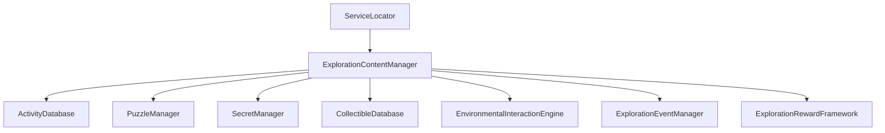

# ACTIVITY SYSTEM SPECIFICATION — HERO OF ETERNIA (PROMPT 25)

## System Overview
The Activity Framework for **Hero of Eternia** is a data-driven exploration content engine managing treasure hunts, puzzle shrines, timed challenges, survival events, and rare resource nodes across world biomes.

---

## 1. Architecture & Services

* **ExplorationContentManager**: Central `IInitializable` manager registering with `ServiceLocator`. Orchestrates activities, puzzles, secrets, collectibles, interactions, dynamic events, and plugin extensions (`IExplorationContentPlugin`).
* **ActivityType**: Enums for 17 Activity types (`TreasureHunt`, `PuzzleShrine`, `HiddenChest`, `TimedChallenge`, `ParkourChallenge`, `CombatChallenge`, `SurvivalEvent`, `FishingSpot`, `RareResourceNode`, `ArtifactDiscovery`, `LoreDiscovery`, `AncientMechanism`, `MemoryFragment`, `MagicAnomaly`, `WorldBossHook`, `SeasonalActivity`, `Custom`).
* **ActivityDefinition**: Data model containing Activity ID, Display Name, Category, Biome Restrictions, Difficulty, Spawn Rules, Completion Conditions, Reward Hooks, Reset Rules, and DLC Fields.

---

## 2. Activity Categories

| Category | Typical Objectives | Reward Types |
|---|---|---|
| Exploration | Finding hidden chests & lore relics | XP, Currency, Artifacts |
| Puzzle | Solving pressure plates & rune shrines | XP, Rare Gear, Attributes |
| Combat | Defeating wave challenges & world mini-bosses | Material Drops, Loot |
| Resource | Gathering rare nodes & fishing spots | Crafting Ingredients |
| Event | Dynamic meteors & resource surges | Seasonal Rewards, Titles |
