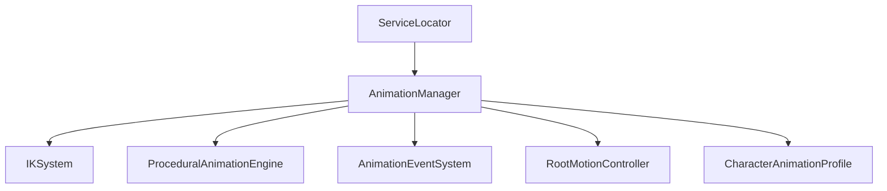

# ANIMATION SYSTEM SPECIFICATION — HERO OF ETERNIA (PROMPT 22)

## System Overview
The Animation Framework for **Hero of Eternia** is a modular, data-driven 3D animation engine designed for mobile hardware (Android) and desktop PC. It orchestrates state transitions across 26 animation states, 10 independent blend layers, inverse kinematics, procedural motion, frame-accurate animation events, root motion extraction, and character profiles.

---

## 1. Architecture & Core Services

* **AnimationManager**: Central `IInitializable` manager registering with `ServiceLocator`. Handles registration, playback, state sync, layer blending, priorities, caching, pooling, and plugin extension interface (`IAnimationPlugin`).
* **AnimationStateDefinitions**: Defines 26 reusable animation states (`Idle`, `Walk`, `Run`, `Sprint`, `Jump`, `Fall`, `Land`, `Swim`, `Climb`, `Crouch`, `Roll`, `Dodge`, `Attack`, `CastAbility`, `Block`, `HitReaction`, `Stunned`, `Interact`, `Gather`, `Craft`, `Sleep`, `Sit`, `Celebrate`, `Death`, `Respawn`, `Custom`).
* **AnimationLayer**: Manages 10 independent blending layers (`FullBody`, `UpperBody`, `LowerBody`, `Head`, `Hands`, `Facial`, `WeaponLayer`, `AdditiveLayer`, `ProceduralLayer`, `CinematicLayer`).
* **IKSystem**: Solves leg/foot ground placement, hand object placement, and weapon alignment. Can be enabled/disabled per character.
* **ProceduralAnimationEngine**: Computes head look-at targets, breathing motion, weapon sway, aim adjustment, and idle variation.
* **AnimationEventSystem**: Frame-accurate event dispatcher supporting footsteps, weapon impacts, ability timing, sound/particle triggers, camera shake, and damage windows.
* **CharacterAnimationProfile**: Data-driven clip mapping for Player, NPC, Merchant, Guard, Bandit, Animal, Monster, Boss, FlyingCreature, and SwimmingCreature.
* **RootMotionController**: Extracts delta positions and rotations for root-motion driven animations with network sync hooks.

---

## 2. Animation Layers & Preemption Rules

| Layer | Type | Typical Usage | Priority Threshold |
|---|---|---|---|
| FullBody | Base | Idle, Locomotion, Full-body attacks | Normal |
| UpperBody | Override | Spell casting while moving | High |
| LowerBody | Override | Running while reloading / blocking | Normal |
| Head | Additive | Head look-at target tracking | Low |
| Hands | Override | Object manipulation & tool holding | Normal |
| WeaponLayer | Additive | Recoil & weapon sway | Low |
| ProceduralLayer | Additive | Idle breathing & terrain posture | Low |

---

## 3. Save V17 Integration
Animation settings (IK toggles, global IK weight, procedural look-at enabled, weapon sway enabled, root motion toggle, debug visualization) are persisted in `SaveProfile` Version 17 via `AnimationSaveData`.
