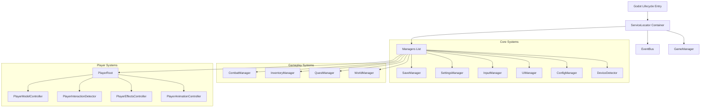

# System Architecture - Hero of Eternia

This document details the software architecture of *Hero of Eternia*, structured under SOLID design principles and built on **Godot 4.3 (C#)**.

---

## 1. High-Level Core Flow

---

## 2. Dependency Injection and EventBus

### ServiceLocator (DI) Container
To prevent tight coupling between managers, we use a thread-safe **ServiceLocator** container implemented in C#. On boot, the main boot scene registers all managers. Dependencies are resolved through initialization calls. Startup times are logged for diagnostics.

### EventBus Strategy
System-to-system communications occur asynchronously via a centralized `EventBus` using C# delegates and events. Managers publish events and subscribe to relevant notifications, eliminating direct linkages between gameplay triggers and UI/Audio reactions.

---

## 3. Local Storage & Serialization
*   **Unified Profile Models:** All stats, achievements, mounts, inventory items, map discoveries, and seeds are stored inside a single `SaveProfile` object.
*   **AES-256 Encryption:** Serialized save profile JSON strings are encrypted using AES-256 to prevent client-side modifications.
*   **SHA-256 Checksums:** A SHA-256 hash is appended to the save file. Mismatches block loads and trigger backup recovery.
*   **Automatic Restores:** If a main save slot is corrupted, the SaveManager automatically recovers using the corresponding `.bak` backup file.

---

## 4. Diagnostics & Error Telemetry
*   **ErrorSystem:** Intercepts unhandled app domain exceptions and fatal asset failures, generating structured reports inside `crash_log.txt`.
*   **PerformanceMonitor:** Tracks FPS, draw calls, process times, and static memory, rendering a green neon text overlay for developer builds.

---

## 5. Player Character & Interaction Framework
*   **PlayerModelController:** Handles dynamic loading and swapping of 11 bone-aligned visual mesh slots (Hair, Body, Armor, Weapon, etc.). Manages mobile performance via Level of Detail (LOD) toggles.
*   **PlayerInteractionDetector:** Spherical Area3D sweep that detects Layer 4 (Interactables), resolving Single Tap, Hold, and Auto triggers, and highlighting targets.
*   **PlayerAttributeSet:** Encapsulates RPG modifier calculations using dirty flags to avoid redundant frame calculations.
*   **PlayerEffectsController:** Status visual effect framework managing particle and shader overlays.
