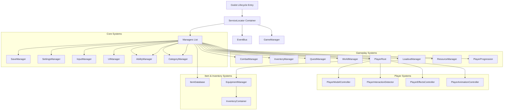

# System Architecture - Hero of Eternia

This document details the software architecture of *Hero of Eternia*, structured under SOLID design principles and built on **Godot 4.3 (C#)**.

---

## 1. High-Level Core Flow

---

## 2. Dependency Injection and EventBus

### ServiceLocator (DI) Container
To prevent tight coupling between managers, we use a thread-safe **ServiceLocator** container implemented in C#. On boot, the main boot scene registers all managers. Dependencies are resolved through initialization calls. Startup times are logged for diagnostics.

### EventBus Strategy
System-to-system communications occur asynchronously via a centralized `EventBus` using C# delegates and events. Managers publish events and subscribe to relevant notifications, eliminating direct linkages between gameplay triggers and UI/Audio reactions.

---

## 3. Local Storage & Serialization
*   **Unified Profile Models:** All stats, achievements, mounts, inventory items, map discoveries, and seeds are stored inside a single `SaveProfile` object.
*   **AES-256 Encryption:** Serialized save profile JSON strings are encrypted using AES-256 to prevent client-side modifications.
*   **SHA-256 Checksums:** A SHA-256 hash is appended to the save file. Mismatches block loads and trigger backup recovery.
*   **Automatic Restores:** If a main save slot is corrupted, the SaveManager automatically recovers using the corresponding `.bak` backup file.

---

## 4. Diagnostics & Error Telemetry
*   **ErrorSystem:** Intercepts unhandled app domain exceptions and fatal asset failures, generating structured reports inside `crash_log.txt`.
*   **PerformanceMonitor:** Tracks FPS, draw calls, process times, and static memory, rendering a green neon text overlay for developer builds.

---

## 5. Player Character & Interaction Framework
*   **PlayerModelController:** Handles dynamic loading and swapping of 11 bone-aligned visual mesh slots (Hair, Body, Armor, Weapon, etc.). Manages mobile performance via Level of Detail (LOD) toggles.
*   **PlayerInteractionDetector:** Spherical Area3D sweep that detects Layer 4 (Interactables), resolving Single Tap, Hold, and Auto triggers, and highlighting targets.
*   **PlayerAttributeSet:** Encapsulates RPG modifier calculations using dirty flags to avoid redundant frame calculations.
*   **PlayerEffectsController:** Status visual effect framework managing particle and shader overlays.

---

## 6. Item & Inventory Ecosystem
*   **ItemDatabase:** Centralized data-driven index preloading configurations and rarities definitions on startup.
*   **InventoryContainer:** Coordinates slot collections, implementing stack merging, splitting, sorting (favorited items prioritized), and filters.
*   **EquipmentManager:** Assigns Helmet, Chest, Weapon, Ring slots and automatically binds/unbinds their attribute modifiers to/from the player's active attribute set.
*   **LootTable & ItemEffects:** Resolves item drop chances and provides consumable effect execution stubs (healing, mana, teleport).

---

## 7. Ability & Progression Systems

### AbilityManager
Central execution framework for all player abilities. Responsibilities:
- Ability activation with full validation pipeline (cooldowns, charges, resources, targets, level requirements)
- Cast time tracking and completion
- Cancellation and interruption handling
- Global cooldown management
- Animation, VFX, and SFX trigger hooks
- Network-ready event-driven architecture
- Save/load of runtime state (cooldowns, charges, cast progress)

### CategoryManager
Extensible category definitions for organizing abilities:
- 11 default categories (Melee, Magic, Ranged, Movement, Support, Healing, Defensive, Summoning, Passive, Ultimate, Utility)
- Runtime registration of new categories without code changes
- Unlock conditions per category

### EffectsManager
Reusable ability effect framework:
- 12 effect types (Damage, Healing, Shield, Teleport, Buff, Debuff, Summon, ProjectileSpawn, AreaCreation, Movement, EnvironmentalInteraction, Custom)
- Stacking with configurable max stacks
- Duration tracking and tick-based processing
- Event-driven lifecycle (applied, expired, stacked)

### LoadoutManager
Configurable ability loadout system:
- Up to 6 loadouts with primary/secondary/passive/ultimate/quick slots
- Save/load persistence with versioning
- Runtime loadout switching

### ResourceManager
Configurable resource pool system:
- 7 resource types (Health, Mana, Stamina, Energy, Focus, Rage, Spirit)
- Configurable max values and regen rates
- No hardcoded assumptions about which resources exist
- Event-driven change notifications

### PlayerProgression
Player level and experience system:
- Level 1-100 with configurable XP curves
- Stat growth hooks per level
- Prestige system (10 levels) with permanent bonuses
- Future seasonal/prestige system support

## 8. Procedural World & Terrain Pipeline
*   **TerrainGenerator:** Employs three layers of FastNoiseLite (Continental simplex noise, Ridged mountains, and valley carving) to generate deterministic heights and biomes from a 64-bit seed.
*   **NavigationFoundation:** Calculates cell-by-cell walkability based on neighbor elevations slope tilt angles and water height thresholds, avoiding expensive runtime graphical scene-tree NavMesh baking.
*   **ChunkManager:** Manages background thread generation via thread-safe concurrent maps and double-radius buffers to protect frame rates.
*   **VegetationSystem:** Adapts environmental spawning counts and probabilities to Low, Medium, and High graphics preset settings.
*   **WorldValidator:** Scans active chunks to detect floating meshes (deviation > 0.5 units), overlaps, and isolated path areas.
