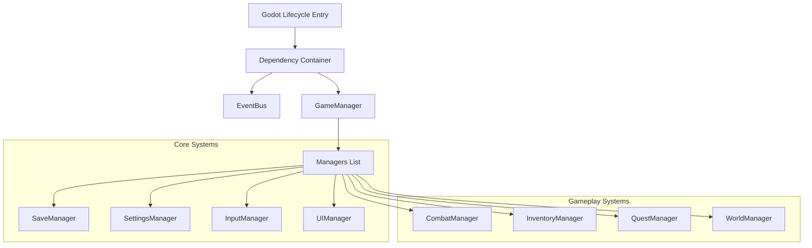

# System Architecture - Hero of Eternia

This document details the software architecture of *Hero of Eternia*, structured under SOLID design principles and built on **Godot 4.x (C#)**.

---

## 1. High-Level Core Flow

---

## 2. Dependency Injection and EventBus

### Dependency Injection (DI) Approach
To prevent tight coupling between managers, we use a lightweight **Service Locator / DI container** implemented in C#. On boot, the main scene container registers all managers. Dependencies are injected via constructor arguments or resolved through initialization calls.

### EventBus Strategy
System-to-system communications occur asynchronously via a centralized `EventBus` using C# delegates and events. Managers publish events (e.g., `OnPlayerDamaged`, `OnQuestCompleted`) and subscribe to relevant notifications, eliminating direct linkages between gameplay triggers and UI/Audio reactions.

---

## 3. Responsibilities of Manager Classes

| System | Primary Responsibility |
| :--- | :--- |
| **GameManager** | Controls the main game state machine (Boot, Menu, Playing, Paused, GameOver). |
| **SceneManager** | Safely transitions scenes, handles async background loading screens. |
| **SaveManager** | Reads/writes slot states, signs profiles, performs migration checks. |
| **AudioManager** | Blends ambient loops, triggers sound effects via audio buses. |
| **SettingsManager** | Manages settings (presetting graphics, scale limits, target framerates). |
| **LocalizationManager**| Fetches translated strings based on system locale keys. |
| **InputManager** | Translates touch joysticks, sliders, gestures, and controller bindings. |
| **ResourceManager** | Pools nodes, preloads meshes/textures, and unloads cached assets. |
| **UIManager** | Governs stack overlays (menus, dialogue boxes, HUD bars, alerts). |
| **QuestManager** | Tracks active quests, logs kills, delivers quest rewards. |
| **InventoryManager** | Manages player items (equips gear, checks weapon slots, handles crafting). |
| **CharacterManager** | Tracks stats (HP, Mana, XP, Skills) of characters/monsters. |
| **CombatManager** | Evaluates hitboxes, damage math, damage calculations. |
| **WorldManager** | Manages procedural systems, spawns ores, triggers asteroid clusters. |
| **NPCManager** | Oversees NPC behaviors (merchant items, dialogue paths). |
| **AIManager** | Manages state loops (Patrol, Alert, Chase, Attack) of enemies. |
| **WeatherManager** | Blends particle effects (rain, space dust, solar flares) dynamically. |
| **TimeManager** | Runs day-night clocks, triggers time-based events. |
| **PerformanceManager**| Monitors framerates, updates resolution scales, garbage collection sweeps. |
| **EventBus** | Dispatches global messages. |

---

## 4. State Machine Strategy
The game utilizes a state pattern structure for both general states (in `GameManager`) and individual entity states (in `AIManager` / `PlayerController`). States are represented by C# classes that implement `Enter()`, `Update(double delta)`, and `Exit()`. Transitions are strictly triggered via status codes or event triggers.
