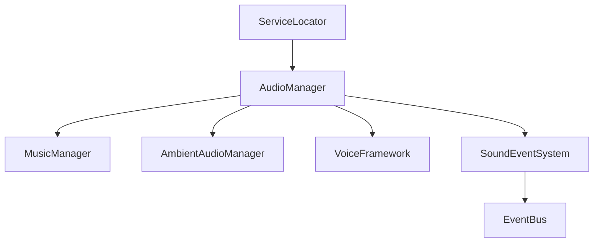

# AUDIO SYSTEM SPECIFICATION — HERO OF ETERNIA (PROMPT 21)

## System Overview
The Audio Framework for **HeroOfEternia** is an offline-first, event-driven 3D sound engine designed for Android mobile hardware and PC. It provides category-based dynamic routing, pool-managed 2D/3D spatial positioning, adaptive music crossfading, multi-layered environment ambience, and localized subtitle voice integration.

---

## 1. Architecture & Services

* **AudioManager**: Central `IInitializable` orchestrator for 2D & 3D sound channel pools (32 2D channels, 16 3D spatial emitters), cache management, volume scaling, and Save V16 integration.
* **MusicManager**: State-machine-based adaptive music crossfading (`Exploration`, `Combat`, `Boss`, `Settlement`, `Dungeon`, `Victory`, `Defeat`).
* **AmbientAudioManager**: Multi-layered ambient zone soundscapes with environmental volume blending.
* **VoiceFramework**: Dialogue barks, subtitle dispatcher with color-coded speaker tags, and localized voice hooks.
* **SoundEventSystem**: Decoupled `EventBus` listener converting gameplay events into audio actions.

---

## 2. Audio Categories

| Category | Priority | Dynamic Range Impact |
|---|---|---|
| Master | Critical | Master gain scalar |
| Music | Medium | Scaled during combat transitions |
| Ambient | Low | Blended during weather/biome shifts |
| Environment | Medium | 3D spatialized attenuation |
| Combat | High | High priority playback pool |
| UI | Critical | Unattenuated instant 2D channels |
| Dialogue | Critical | Voice priority over ambient/music ducking |
| NPC | High | Spatial barks and greetings |
| Creatures | High | Enemy roar & attack indicators |
| Weather | Medium | Environment layer modulation |
| Footsteps | Low | Surface-driven random pitch modulation |
| Abilities | High | Skill activation feedback |
| VoiceOver | Critical | Story and quest voice lines |
| DeveloperDebug | Critical | Audio diagnostics channel |

---

## 3. Dynamic Range Profiles

1. **Mobile (Default)**: Optimized for phone/tablet speakers with boosted high-frequency clarity.
2. **Headphones**: Balanced stereo spatialization and dynamic depth.
3. **Midnight**: Compressed dynamic range to tame loud combat effects during low-volume sessions.
4. **Full**: High dynamic range uncompressed output for home theater / desktop audio.

---

## 4. AI Asset Production Manifest

### Music Generation Prompts
* **Exploration Theme**: *"Heroic fantasy orchestral ambient music, gentle acoustic lute, soft strings, calm wind instruments, mystical nature mood, 90 BPM, seamlessly loopable."*
* **Combat Theme**: *"High-energy fantasy battle theme, heavy percussion, dramatic brass, fast violin ostinato, intense action RPG mood, 140 BPM, loopable."*
* **Boss Raid Theme**: *"Epic orchestral dark fantasy boss theme, gothic choir, massive drums, intense brass fanfares, apocalyptic titanium titan battle music, 150 BPM."*

### Sound Effect Generation Prompts
* **Sword Swing**: *"Sharp metallic blade swoosh through air, high fidelity sword swing."*
* **Fireball Cast**: *"Whoosh sound of fire burst launching into air with sizzling flame tail."*
* **Footstep Dirt**: *"Crunchy boot footstep on loose gravel dirt."*

---

## 5. Verification & Performance Standard
* **Channels**: 32 concurrent 2D streams, 16 3D positional players.
* **Memory Budget**: < 25 MB RAM allocated for cached streams on Android targets.
* **Latency**: < 15ms audio trigger delay.
