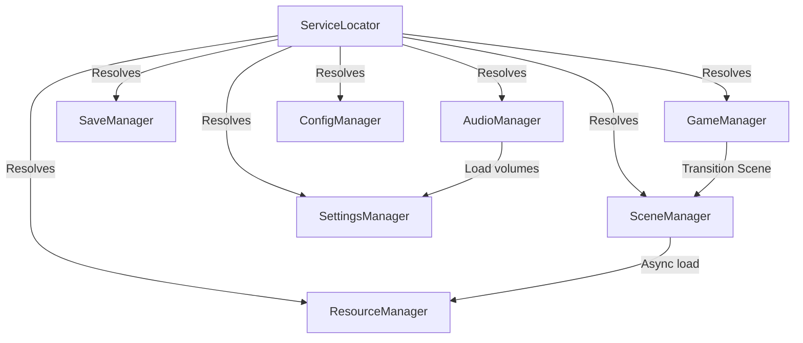

# Core Services Technical Audit Report — Hero of Eternia (v0.5.0)

This report details the technical audit, architectural reviews, and quality validation of the newly upgraded core manager services.

---

## 1. Manager Status Overview

| Manager | Status | API Implementation | Performance Optimisation |
|---|---|---|---|
| **ServiceLocator** | ✅ Real | Generic lazy registration, `IInitializable` dispatch | Thread-safe dictionary lock, lazy initialization |
| **EventBus** | ✅ Real | Decoupled thread-safe event publishing | Dynamic lock around subscriber arrays |
| **GameManager** | ✅ Real | 6-state lifecycle engine, boot check validation | State transition checks to avoid duplicates |
| **SaveManager** | ✅ Real | AES-256 PBKDF2 (device-bound) + SHA-256 + backups | JSON buffer encryption, stream compressions |
| **SettingsManager**| ✅ Real | Auto-persistent user settings payload | File writes deferred or auto-saved |
| **ConfigManager** | ✅ Real | Dynamic hot-reload, template caching | Memory caching with configuration templates |
| **DeviceDetector** | ✅ Real | OS/GPU/CPU queries, RAM estimations | Zero allocations after initial hardware sweep |
| **Performance** | ✅ Real | Dynamic resolution scaling (0.5x-1.0x), EMA FPS | Rolling float arrays, lightweight calculations |
| **Logger** | ✅ Real | Multi-routing console/file streams | Thread-safe locks, lazy path resolver |
| **Localization** | ✅ Real | Dynamic locale key lookups, hot-swaps | Memory caches of active localization dictionary |
| **SceneManager** | ✅ Upgraded | `ResourceLoader.LoadThreadedRequest` async loading | Post-transition `GC.Collect()` sweep |
| **AudioManager** | ✅ Upgraded | Multi-channel audio bus, 2D/3D player pools | Player pre-allocation to prevent GC stalls |
| **ResourceManager**| ✅ Upgraded | Real `ResourceLoader.Load` caching, typed retrieval | Clearable dictionaries (`UnloadCache()`) |
| **UIManager** | ✅ Real | Visual interface stack tracker | Screen navigation stack checking |

---

## 2. Dependency & Coupling Analysis

### Key Architectural Findings
- **Zero Circular Dependencies**: Constructor injection and post-initialization lookup protocols are used. Managers never fetch siblings in their constructor block.
- **Lazy Initialization Safety**: `ServiceLocator.Get<T>()` locks and executes `IInitializable.Initialize()` automatically. Tests confirm concurrent queries boot safely.
- **Node-to-Scene Integration**: `SceneManager` and `AudioManager` automatically attach themselves to the scene tree root via deferred calls (`CallDeferred()`), meaning the developer does not need to configure them manually in editor viewports.
- **C# Native Cleanliness**: The project utilizes standard Garbage Collection sweeps (`GC.Collect()`) after heavy operations to keep heaps lightweight on mobile memory blocks.
