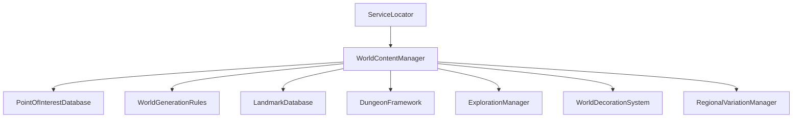

# POINT OF INTEREST SYSTEM SPECIFICATION — HERO OF ETERNIA (PROMPT 24)

## System Overview
The Point of Interest (POI) Framework for **Hero of Eternia** is a data-driven procedural content placement engine managing ruins, camps, watchtowers, shrines, mines, and natural landmarks across world biomes.

---

## 1. Architecture & Services

* **WorldContentManager**: Central `IInitializable` manager registering with `ServiceLocator`. Orchestrates POI placement, landmarks, decoration generation, exploration, and plugin extensions (`IWorldContentPlugin`).
* **POIType**: Enums for 21 POI types (`AncientRuins`, `AbandonedCamp`, `Watchtower`, `CaveEntrance`, `Mine`, `Shrine`, `Temple`, `Waterfall`, `Lake`, `RiverCrossing`, `Bridge`, `HiddenGrove`, `StoneCircle`, `WizardTower`, `BanditCamp`, `HunterCabin`, `Farm`, `Graveyard`, `MonsterNest`, `MagicRift`, `Seasonal`).
* **POIDefinition**: Data model containing POI ID, Display Name, Type, Biome Restrictions, Minimum Distance Rules, Spawn Weight, Difficulty Rating, Size, Audio Hooks, and Loot Hooks.

---

## 2. Distance & Density Rules

* **MinDistanceToSameType**: Prevents repetitive clustering of identical POI types (default 300m).
* **MinDistanceToSettlement**: Keeps wild POIs at a safe radius from cities (default 150m).
* **MinGlobalPoiSpacing**: Global spatial buffer between any two POIs (default 100m).
