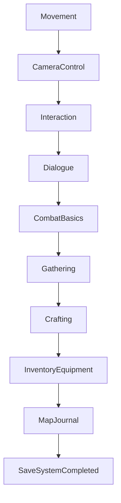

# PROLOGUE SPECIFICATION — HERO OF ETERNIA (PROMPT 28)

## Overview & Opening Flow
The Prologue introduces players to **Hero of Eternia** in the peaceful starting village of **Oakvale** (`region_starting_kingdom`). Movement, camera controls, NPC interactions, inventory management, combat, and quest progression are introduced contextually without intrusive UI popups.

---

## 1. Contextual Tutorial Progression (`IntroductionFlowManager.cs`)

---

## 2. Key Story Beat
The player awakens in Oakvale, meets **Elder Alden**, learns basic swordplay on the training field with **Captain Valerius**, and investigates bandit raids threatening the village trade roads.
