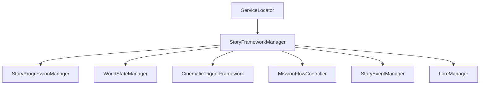

# STORY SYSTEM SPECIFICATION — HERO OF ETERNIA (PROMPT 26)

## System Overview
The Story Progression Framework for **Hero of Eternia** is a data-driven campaign orchestrator managing chapters, acts, story missions, world-state transitions, cinematic triggers, mission checkpoint flow, story event overrides, and historical lore codex.

---

## 1. Architecture & Services

* **StoryFrameworkManager**: Central `IInitializable` manager registering with `ServiceLocator`. Orchestrates chapters, world states, triggers, mission checkpoints, story events, lore, and plugin extensions (`IStoryContentPlugin`).
* **StoryEntry & StoryDatabase**: Data models and registries for story missions with level recommendations, prerequisites, and DLC fields.
* **ChapterFramework**: Campaign chapter structure engine managing prologues, acts, chapters, missions, interludes, and finale hooks.

---

## 2. Save Integration
Story progression, active missions, world state flags, and lore discoveries are persisted in `SaveProfile` Version 21 via `StoryProgressionSaveData`.
