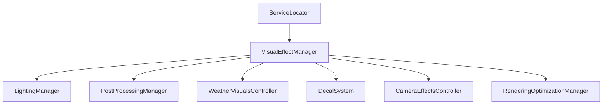

# VISUAL EFFECTS SPECIFICATION — HERO OF ETERNIA (PROMPT 23)

## System Overview
The Visual Effects Framework for **Hero of Eternia** is a data-driven, mobile-optimized presentation engine managing particle playback, decal pooling, camera impulses, and visual effect plugins.

---

## 1. Architecture & Services

* **VisualEffectManager**: Central `IInitializable` manager registering with `ServiceLocator`. Handles effect registration, pooling, playback, lifetime tracking, priority handling, and plugin extensions (`IVFXPlugin`).
* **ParticleDefinitions**: Data-driven configurations for 16 particle types (`Dust`, `Smoke`, `Fire`, `Magic`, `WaterSplash`, `RainSplash`, `Snow`, `Leaves`, `Sand`, `Spark`, `Explosion`, `Healing`, `Buff`, `Debuff`, `Environmental`, `Custom`).
* **DecalSystem**: Spawns and recycles ground decals (`Footprint`, `Blood`, `ScorchMark`, `WaterRipple`, `Mud`, `SnowTrack`, `Crack`, `MagicCircle`) with automatic lifetime fading and distance-culling limits.
* **CameraEffectsController**: Impulses for camera shake, impact zooms, screen damage flashes, and environmental blur.

---

## 2. Priority & LOD Thresholds

| Priority | Mobile Behavior | Culling Distance |
|---|---|---|
| Low | Culled on Low quality preset | 30m |
| Medium | Rendered with reduced particle count | 50m |
| High | Always rendered | 80m |
| Critical | Always rendered with high priority | Unlimited |
